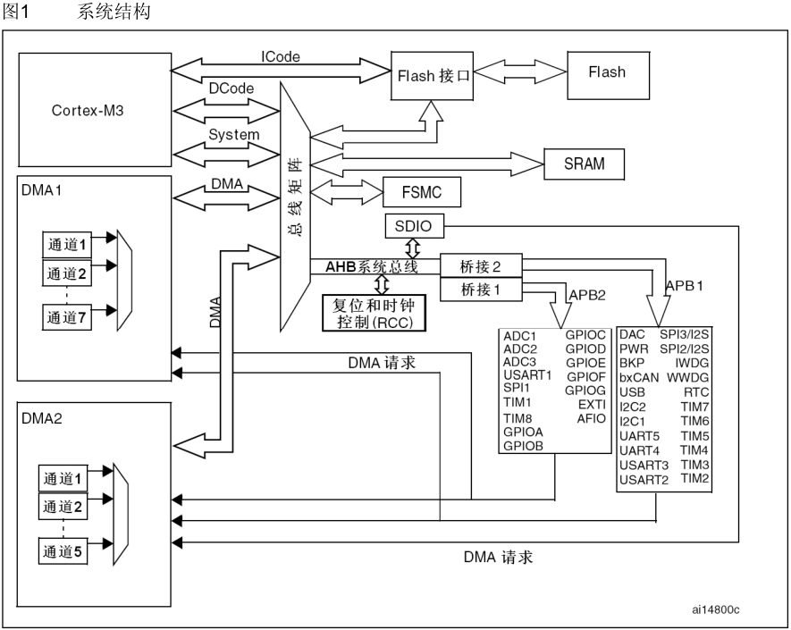
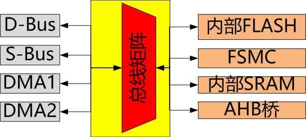

> &emsp;&emsp;编写MCU外设模块驱动时，经常会配置DMA的使用，之前在ADC采集，UART模块通信中都使用过，但是只知道使用，具体没细究过。

> &emsp;&emsp;找了之前用过的几款MCU芯片(51&52系列,STM32F系列,MC9S12系列,S32K14系列等)，也找了几款SOC芯片的数据手册，但是发现只有STM32F系列的文档中有具体的总线介绍，现就基于STM32F1系列芯片的总线框图，总结以下我对DMA的理解。

# 1. 系统框图

> 以下是从STM32参考手册中截取的结构框图：

# 2. DMA相关单元

- 驱动单元
  - Cortex™-M3内核DCode总线(D-bus)；
  - Cortex™-M3内核系统总线(S-bus)；
  - 通用DMA1；
  - 通用DMA2；
- 被动单元
  - 内部SRAM；
  - 内部闪存存储器；
  - FSMC；
  - AHB到APB的桥(AHB2APBx)；
- 总线矩阵

    > &emsp;&emsp;为什么会有"DMA和CPU有竞争"这么一说？
    > &emsp;&emsp;其实理解了**总线矩阵**，就应该知道了原因，原理类似木桶效应(一个木桶盛水多少取决于最短的那块木板)。总线矩阵就是那块最短的木板，任何驱动单元要通过总线矩阵访问存储单元，都需要仲裁，每个时刻，有且只有一个驱动单元能通过总线矩阵进行访问存储单元，所以就出现了竞争关系。

    

# 3. DMA无关单元

- Cortex™-M3内核ICode总线(I-bus)
    > &emsp;&emsp;从框图上可以看出，I-Bus直接与"FLASH接口"相连，中间没有总线矩阵参与，所以CPU的指令预取操作和DMA不冲突。也就是说，即使CPU在进行取指操作，DMA也可以同时工作。

# 4. 摘录相关概念介绍

- Code 总线
    > &emsp;&emsp;该总线将Cortex™-M3内核的指令总线与闪存指令接口相连接。指令预取在此总线上完成。

- DCode 总线
    > &emsp;&emsp;该总线将Cortex™-M3内核的DCode总线与闪存存储器的数据接口相连接(常量加载和调试访问)。

- 系统总线 
    > 此总线连接Cortex™-M3内核的系统总线(外设总线)到总线矩阵，总线矩阵协调着内核和DMA间的访问。

- DMA 总线
    > &emsp;&emsp;此总线将DMA的AHB主控接口与总线矩阵相联，总线矩阵协调着CPU的DCode和DMA到SRAM、闪存和外设的访问。
    
- 总线矩阵
    > &emsp;&emsp;总线矩阵协调内核系统总线和DMA主控总线之间的访问仲裁，仲裁利用轮换算法。

- AHB/APB 桥(APB)
    > &emsp;&emsp;AHB外设通过总线矩阵与系统总线相连，允许DMA访问。
    > &emsp;&emsp;两个AHB/APB桥在AHB和2个APB总线间提供同步连接。APB1操作速度限于36MHz，APB2操作于全速(最高72MHz)。
